# Laboratorio 9

## Integrantes

- Rony Bellido
- Mauricio Rojas
- Xiomara Garcia

## 📸 Capturas del proceso

## Bellido Chambi Rony Widmer
# Capturas:
### 1. Clonar repositorio


### 2. Levantar proyecto


### 3. Consumir data de TMDB


### 4. Implementar estado global (Zustand)


### 5. Desarrollar todas los pages


### 6. Agregar pasarela de pagos de película comprada (Simulación)


### 7. Agregar tests al proyecto


## Mauricio Rojas 
## Datos del informe

- Alumno: Mauricio Lucianno Rojas Tello
- GitHub: https://github.com/blaxells-zlipper/evaempfinal
- Video: https://youtu.be/AtfQgpFSIEk

El informe PDF incluye evidencia de:

- Desarrollo de todas las paginas principales.
- Checkout simulado.
- TMDB API en uso.

## Objetivo del proyecto

El objetivo es demostrar una aplicacion web moderna con rutas, componentes,
estado global, consumo de API, renderizado de informacion, validaciones de
formulario, pago simulado y pruebas automatizadas.

## Stack utilizado

- React 19: construccion de componentes y vistas.
- TypeScript: tipado de peliculas, carrito y servicios.
- Vite: entorno de desarrollo y build del proyecto.
- React Router: navegacion entre paginas.
- TanStack Query: manejo de fetching, cache y estados de carga.
- Axios: cliente HTTP para consumir TMDB.
- Zustand: estado global del carrito de compras.
- React Hook Form: manejo del formulario de pago.
- Zod: validacion del formulario de checkout.
- TailwindCSS: estilos utilitarios y responsive design.
- shadcn/radix-ui: componentes UI reutilizables.
- Lucide React: iconos de navegacion y acciones.
- Vitest y Testing Library: pruebas del store y componentes.
- Playwright: verificacion visual de flujos en navegador.

## Que usa la web

La web usa una arquitectura simple por carpetas:

- `src/routes/router.tsx`: define las rutas principales.
- `src/pages`: contiene las paginas `Home`, `Movies`, `MovieDetail` y
  `Checkout`.
- `src/components`: contiene componentes reutilizables de layout, peliculas y
  UI.
- `src/services/movie-api.ts`: consume TMDB con Axios y usa datos locales si no
  hay credenciales.
- `src/stores/cart-store.ts`: implementa el carrito global con Zustand.
- `src/data/movies.ts`: datos locales de respaldo para la presentacion.
- `src/test/setup.ts`: configuracion de pruebas.

## Paginas desarrolladas

- `/`: landing principal de CineSpoilerS Store.
- `/movies`: cartelera con peliculas renderizadas.
- `/movies/:movieId`: detalle de una pelicula.
- `/checkout`: resumen del carrito y pasarela de pago simulada.


## Como probar la web

1. Abrir `http://localhost:5173`.
2. Entrar a `Movies` para ver peliculas renderizadas.
3. Presionar `Detalle` para abrir la pagina de una pelicula.
4. Presionar `Agregar al carrito` o `Comprar`.
5. Verificar que el contador del carrito cambia.
6. Entrar a `Checkout`.
7. Completar el formulario con:

```txt
Nombre completo: Mauricio Demo
Correo: demo@mail.com
Tarjeta demo: 4242424242424242
```

8. Presionar `Pagar`.
9. Verificar el mensaje de compra simulada correctamente.

## Comandos de validacion

Ejecutar lint:

```powershell
npm run lint
```

Ejecutar build:

```powershell
npm run build
```

Ejecutar tests:

```powershell
npm test
```
```

## Evidencia visual incluida

- `docs/browser-home-check.png`: cartelera renderizada.
- `docs/browser-checkout-check.png`: checkout con pago simulado.

## Versiones usadas

```txt
Node: v24.16.0
npm: 11.16.0
```
# Capturas:
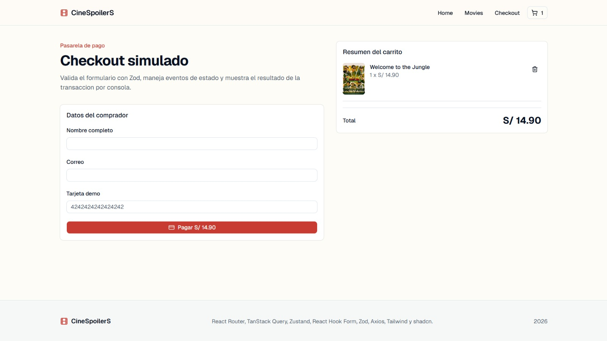
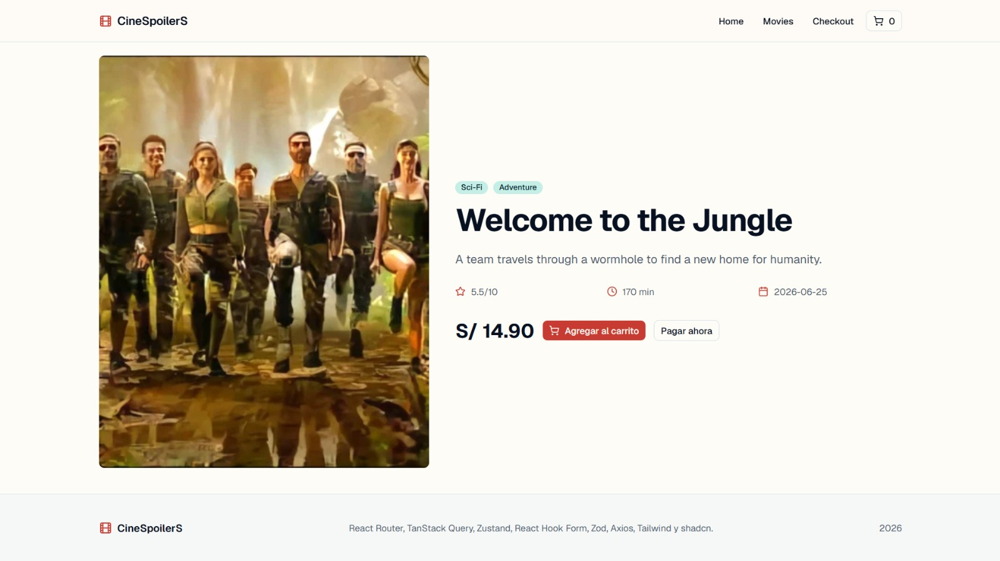
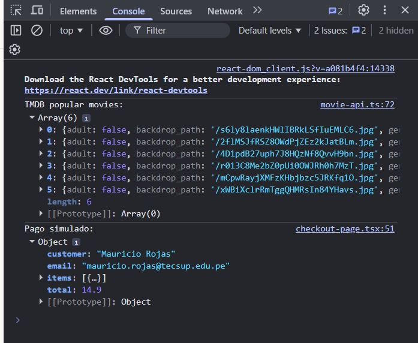
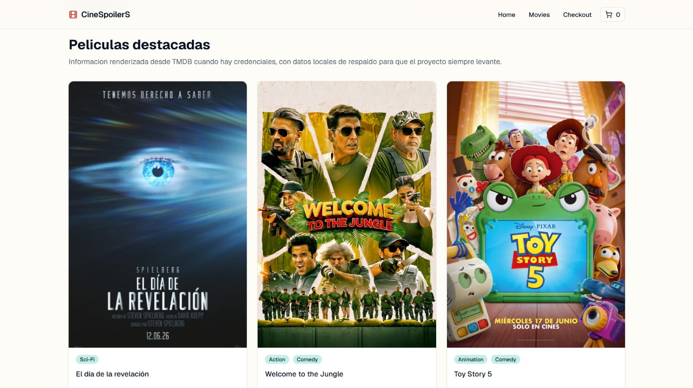
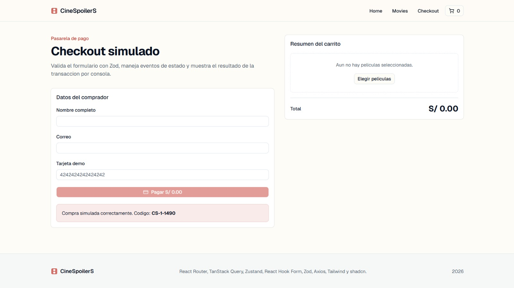

## Garcia Silva Xiomara
# Capturas:
## Implementación — Pasarela de Pago (Consumo de API, Estado Global, Checkout y Tests)

### a. Clonar repositorio
Clonación del repositorio del proyecto de forma local.

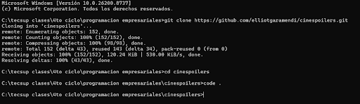

### b. Levantar proyecto
Instalación de dependencias (npm install), configuración de variables de entorno y ejecución del servidor de desarrollo (npm run dev).

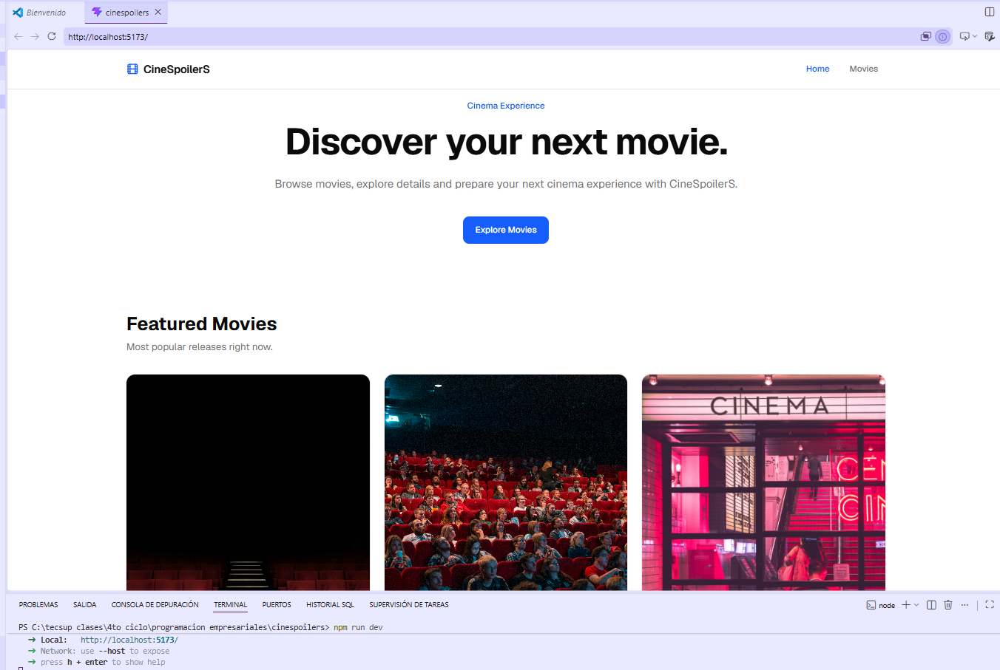

### c. Consumir data de TMDB
Integración con la API de The Movie Database (TMDB) mediante Axios y React Query, incluyendo un mapper para transformar la respuesta de la API al modelo Movie usado en la UI.

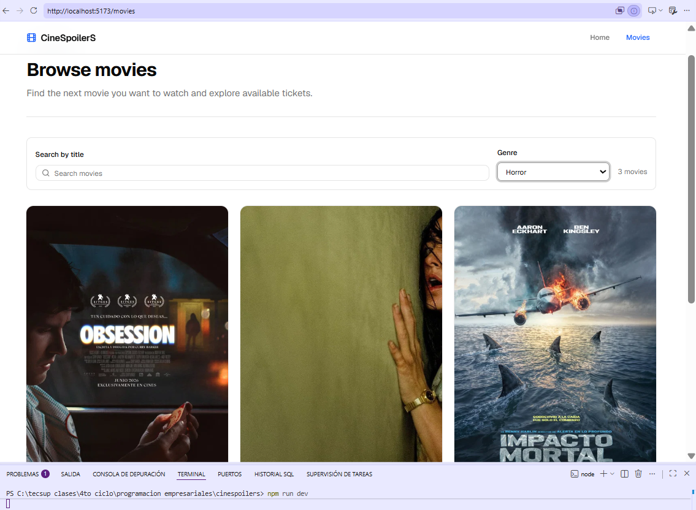

### d. Implementar estado global (Zustand)
Creación de un store global con Zustand (useCartStore) para gestionar el carrito de compras (agregar, quitar y verificar películas).

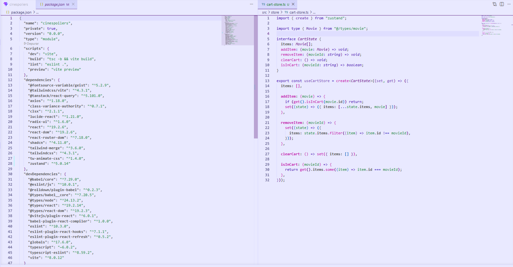

### e. Desarrollar todas las pages
Desarrollo de las páginas principales: HomePage, MoviesPage (con búsqueda y filtro por género) y MovieDetailPage (detalle de película con acción de compra conectada al store).

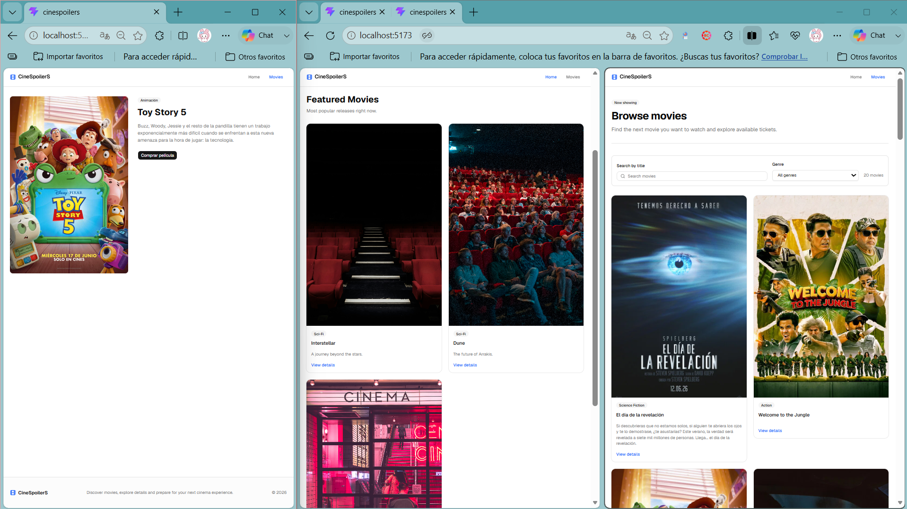

### f. Agregar pasarela de pagos de película comprada (Simulación)
Implementación de un flujo de checkout simulado: formulario de datos de tarjeta con validaciones, resumen de compra y confirmación de pago exitoso, limpiando el carrito al finalizar.

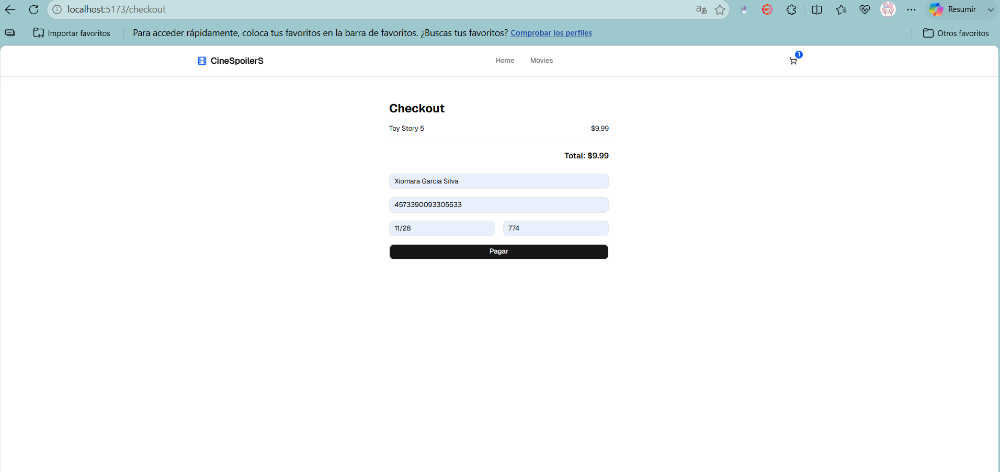
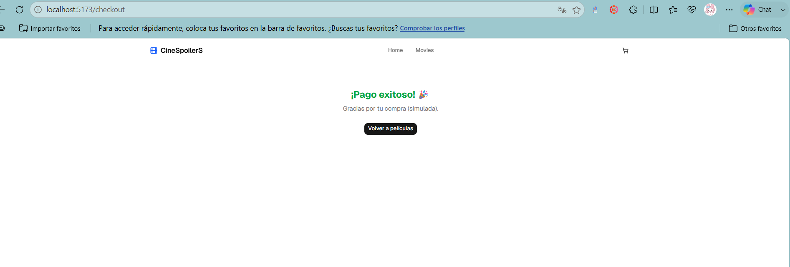

### g. Agregar tests al proyecto
Configuración de Vitest + Testing Library, con pruebas unitarias sobre el store del carrito (cart-store.test.ts) y sobre el componente MovieCard (movie-card.test.tsx). Todos los tests pasan correctamente.

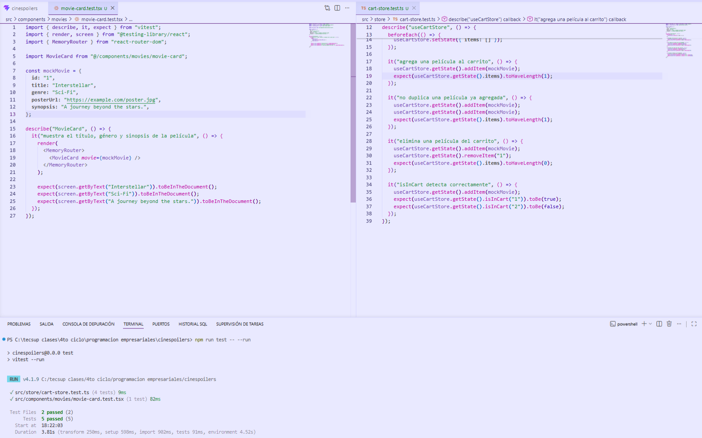