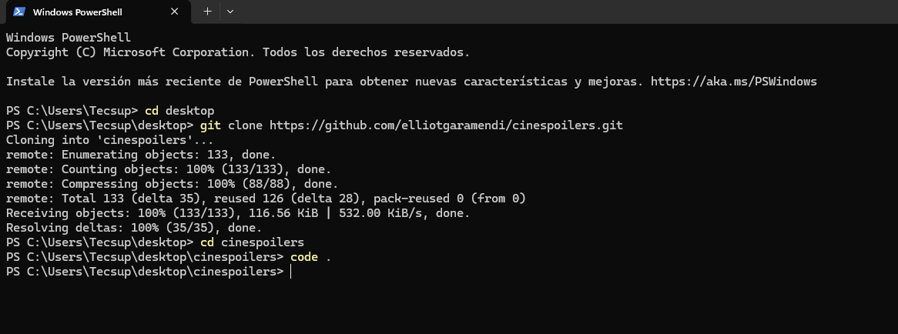
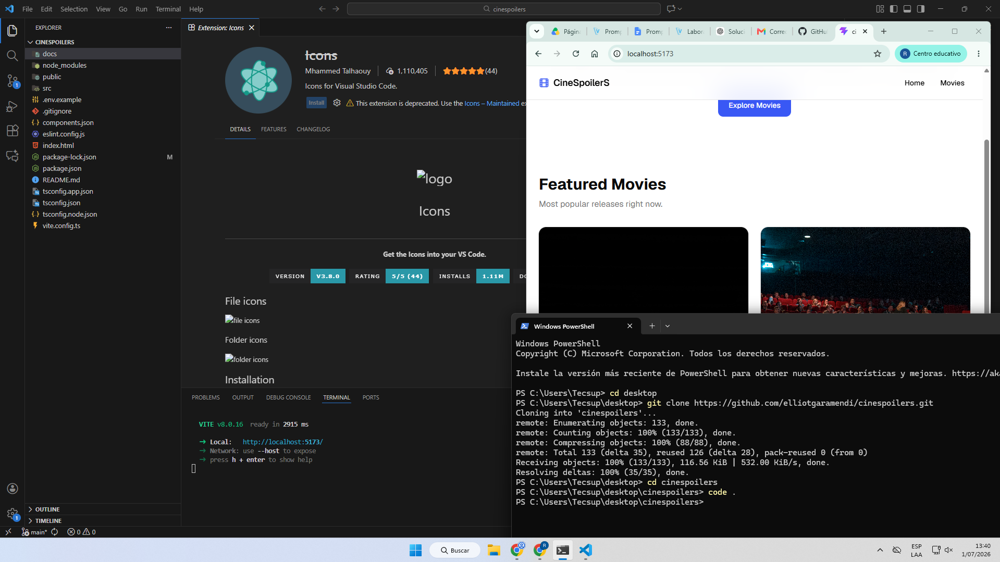
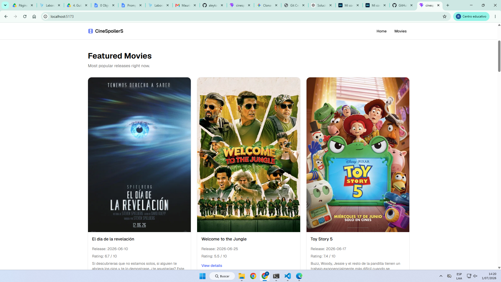
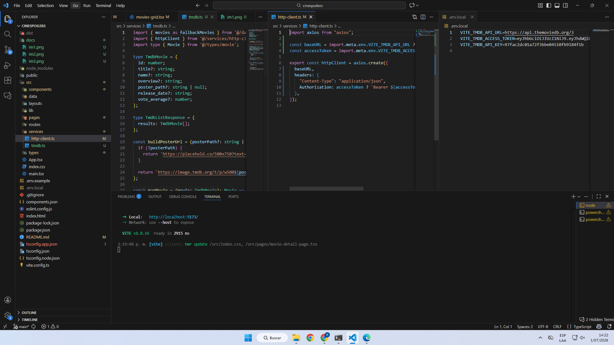
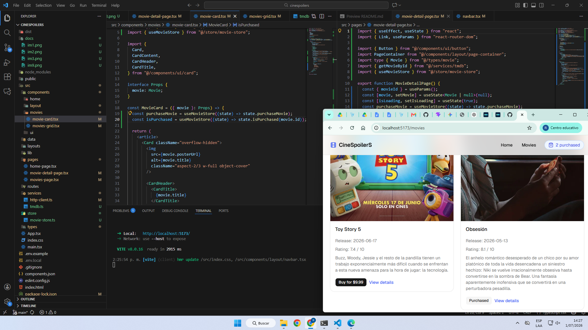
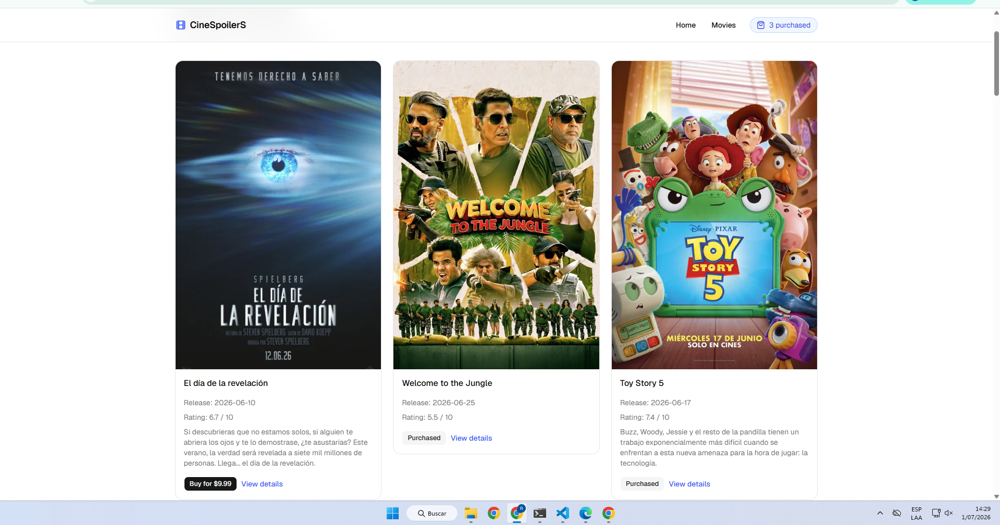
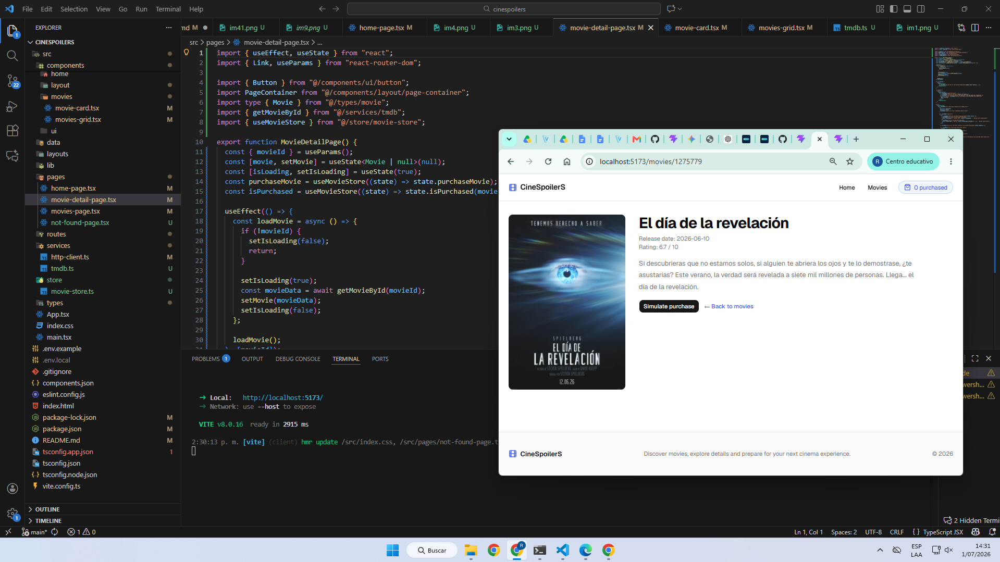
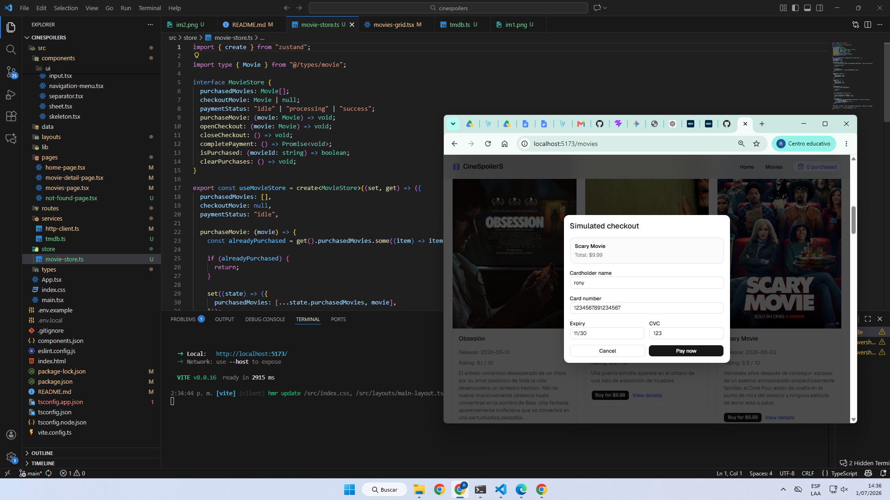
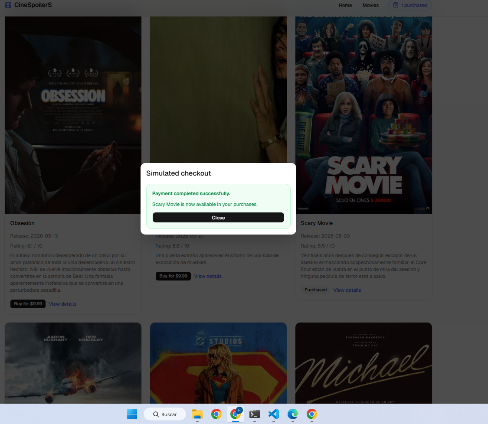
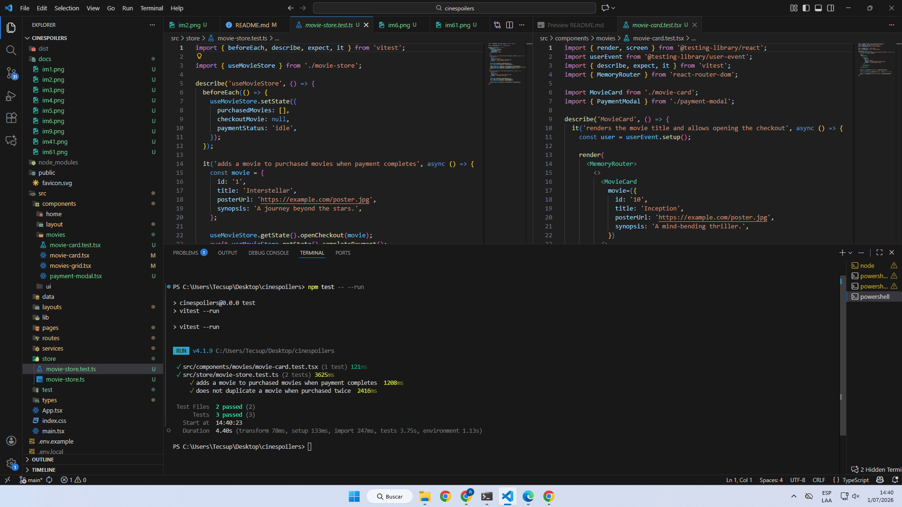

# Laboratorio 9

## Integrantes

- Rony Bellido
- Mauricio Rojas
- Xiomara Garcia

## 📸 Capturas del proceso

## Bellido Chambi Rony Widmer
# Capturas:
### 1. Clonar repositorio

### 2. Levantar proyecto

### 3. Consumir data de TMDB

### 4. Implementar estado global (Zustand)

### 5. Desarrollar todas los pages

### 6. Agregar pasarela de pagos de película comprada (Simulación)

### 7. Agregar tests al proyecto

## Mauricio Rojas 
# Capturas:
## Garcia Silva Xiomara
# Capturas:
